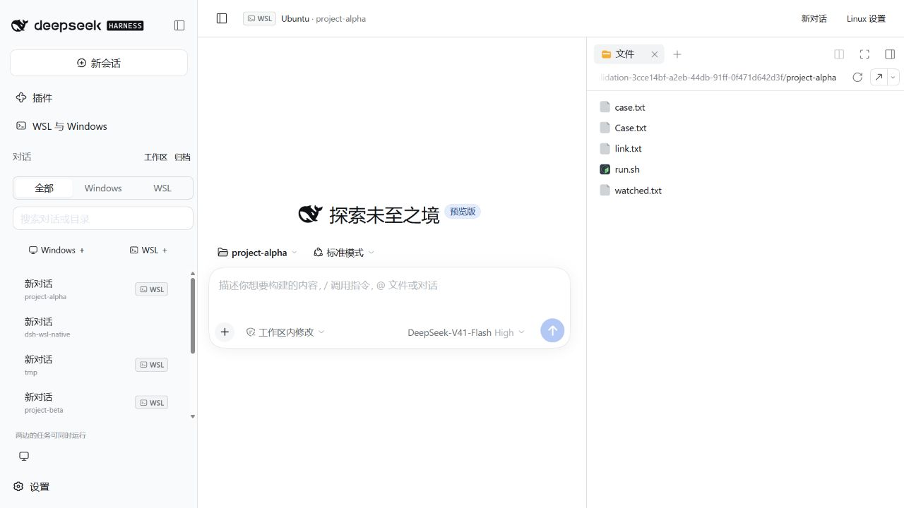

# DSH for WSL

在同一个 Windows DSH 窗口里使用 Windows 和原生 Linux 对话。WSL 对话带有标志，点击对话即可切换环境，保留各自的草稿和任务。包名为 `dsh-wsl-native`，当前版本为 **0.6.2**，适配 **DeepSeek Harness 0.2.0-rc.2**，支持 Windows Desktop 和 Windows Web。

[下载安装包](https://github.com/Han-1413141/dsh-wsl-native/releases/latest) · [桌面端安装与使用](docs/desktop.md) · [完整手册](docs/usage.md) · [问题反馈](https://github.com/Han-1413141/dsh-wsl-native/issues)

插件提供两种用法：

| 用法 | DSH 在哪里运行 | 适合的工作 |
| --- | --- | --- |
| Windows DSH + WSL 工具 | Windows | 保留 Windows 会话和工具，通过插件执行 Linux 命令、处理 Linux 文件 |
| 从 Windows 启动 Linux DSH | WSL 的 Linux 文件系统 | 让整个 DSH、原生 Bash 和工作区在 Linux 中运行，同时访问 Windows 文件、程序和剪贴板 |

两种用法可以同时运行。Windows DSH 保留自己的 PowerShell、文件工具和会话；Linux DSH 使用 Linux 的 Bash、文件工具、工作区和依赖。进入另一环境不会停止原来的任务。命令和文件操作通过常驻进程通信，执行桥不监听网络端口；Linux 文件由 Linux 进程直接处理。

## 快速开始

需要 Windows、已安装的 WSL 2 发行版，以及两端可用的 Node.js。支持 Node.js `22.19+` 的 22.x 系列或 `24+`；Linux 端必须是 Linux Node，不能指向挂载盘上的 `node.exe`。Linux DSH 安装还需要 Linux npm；Windows 辅助下载需要 Windows npm。

### 安装到 Windows 桌面端

从 [GitHub Releases](https://github.com/Han-1413141/dsh-wsl-native/releases/latest) 下载 `dsh-wsl-native-0.6.2.tgz`，保留在固定目录。在 PowerShell 中使用 **桌面端附带的 CLI** 安装；将下面的路径换成本机安装目录和包路径：

```powershell
$dshDesktop = 'F:\deepseek harness\resources\runtime\cli\bin\dsh.cmd'
& $dshDesktop plugin --profile desktop add 'C:\Downloads\dsh-wsl-native-0.6.2.tgz'
```

`desktop` 是桌面端配置，`web` 是另一个配置。已在 PATH 中配置桌面端 CLI 时，也可直接使用 `dsh plugin --profile desktop add ...`。安装后在桌面端查找 **WSL 与 Windows**；若当前窗口尚未显示入口，等当前任务结束后从托盘退出 DSH，再重新打开。

源码仓库还提供 `scripts/install-desktop.ps1`，会先备份桌面端配置，再安装并检查插件版本和已有插件。具体命令、更新及卸载见[桌面端说明](docs/desktop.md)。

### 同时使用 Windows 与 Linux DSH

打开侧边栏 **WSL 与 Windows**，选择发行版和项目目录：

1. 点击 **开始 WSL 对话**。插件准备依赖、启动 Linux DSH，在当前窗口的主区域打开原生 Linux 对话。
2. 左侧同一个列表显示两边的对话；Linux 对话右侧有 **WSL** 标志。点击 Windows 或 WSL 对话即可切换，不跳转整个页面。
3. 默认保留原生工作区，并在其中显示带 **WSL** 标记的项目与对话。点击“工作区”标题右侧的小切换按钮，进入紧凑对话列表；点击同一位置的按钮切回。
4. 侧栏顶部直接提供 **Windows**、**WSL** 两个新建按钮。工作区标题右侧带 **WSL** 标识的文件夹加号可新建 WSL 工作区，支持浏览和创建 Linux 文件夹。
5. WSL 工作区直接使用 DSH 原生列表，支持拖动排序、折叠、重命名、移除和指定项目新建对话。对话支持置顶、重命名、分支和归档。
6. 在对话菜单选择 **交接工作…**，把工作说明交给另一环境的已有或新建对话。支持预览、可编辑的最近对话摘录、交接草稿和排队发送。详见[工作区与交接](docs/workspaces.md)。
7. WSL 对话顶部的 **Linux 配置** 直接打开 Linux 插件管理。环境面板中的 **Linux 插件与配置** 可以控制继承选项。原有 **新窗口打开** 方式继续保留。

每个发行版和用户分别记忆最近目录。再次进入同一项目时优先打开上次查看的会话。目录输入接受 Linux、Windows 和 WSL UNC 路径，验证成功后才更新设置。从 Windows 插件进入时，Linux 默认继承当前主环境的插件、设置和模型账号；在 Linux 单独修改的项目会保留。详见[继承与独立调整](docs/inheritance.md)。

两边共用窗口和对话列表，各条对话继续使用所属环境的运行进程、权限和文件系统。切换不会迁移一条对话到另一个系统。账号继承仅在本机准备 Linux 环境时进行，可在环境面板关闭；会话数据保持独立。Desktop 使用 DSH 官方隔离网页容器；Web 使用同窗口嵌入页。两种入口共用会话列表和环境管理。

推荐把 Linux 项目放在 `/home/<用户>/...`。DSH 本体、插件和依赖也安装在 Linux 文件系统，保留大小写敏感文件名、符号链接、可执行权限和文件监听。Windows 挂载目录可以使用，面板会说明频繁读写时的取舍。

### 通过命令行启动 Linux DSH

在本项目目录打开 PowerShell。交付包已经包含构建产物，可直接执行：

```powershell
node .\bin\dsh-wsl.mjs list
node .\bin\dsh-wsl.mjs doctor --distro Ubuntu
node .\bin\dsh-wsl.mjs setup --distro Ubuntu
node .\bin\dsh-wsl.mjs start --distro Ubuntu --cwd /home/codex
```

将 `Ubuntu` 和 `/home/codex` 换成自己的发行版、Linux 目录。`start` 打开本机 DSH 页面，保持当前终端运行；按 `Ctrl+C` 停止该实例。第一次打开时，在 DSH 中配置自己的模型账号或 API Key，并添加 Linux 工作区。

安装位置是所选 Linux 用户的 `~/.local/share/dsh-wsl-native/`。DSH 数据放在其中的 `dsh-home/`，与已有 Windows DSH 数据分开。直接运行 CLI 时没有主 DSH 配置上下文，因此不会自动继承；从 Windows DSH 插件入口启动则默认继承主环境插件、设置和模型账号。两种入口均不复制历史会话。

Windows 上的 `setup` 默认由 Windows npm 下载依赖，再由 Linux npm 离线安装。安装脚本仍在 Linux 执行；个别第三方安装脚本如果自行联网，仍需要对应网络条件。可以用 `--install-network linux` 改为 Linux 直接下载。再次执行 `setup` 会更新插件快照，已成功安装的同版本 DSH 会被复用；修复损坏安装用 `--reinstall`。

### 安装到 Windows Web 配置

安装到需要使用的 DSH 配置：

```powershell
dsh plugin --profile web add "C:\path\to\dsh-wsl-native-0.6.2.tgz"
dsh web
```

也可把安装源换成本项目的绝对目录。`web` 是这里演示的配置名称，其他配置需要分别安装。只需要在 Windows 会话中调用 Linux 工具时，在面板选择发行版与目录，点击“连接 WSL”或“应用工作目录”即可。Linux 用户可在“高级设置”中指定。

管理页面使用 DSH 原生控件，跟随浅色、深色主题，并适应窄窗口。点击“浏览”可选择 Linux 文件夹，支持返回上级、隐藏项、排序和分页加载。“运行与连接管理”提供预先准备与按环境停止操作。

Windows 原有工具继续工作。插件增加的工具以 `wsl_native_` 开头；面板中的 Linux 目录只作为这些工具的默认目录。它不会把现有 Windows 工作区自动转换成 Linux 工作区。

在已有 Linux DSH 中同样可以安装该包。此时 `wsl` 目标使用当前发行版和当前 Linux 用户，`windows` 目标经 WSL 互操作访问 Windows。自定义 Windows Node 路径见[配置说明](docs/usage.md#配置)。



上图是 0.3.0 的历史截图。0.6.2 已收起常驻搜索与筛选区，新增原生工作区切换按钮，并隐藏 Linux 的重复侧栏。

## 可以做什么

- 复用 Windows、Linux 常驻工作进程；并发命令各自使用明确的目录和环境变量。
- 双向执行 Bash、PowerShell 或程序参数数组；超时、取消时回收子进程树。
- 原生列目录、分页读取 UTF-8／GB18030 文本、原子写入，保留符号链接；支持旧文件 SHA-256 冲突检查。
- 在两端分块复制二进制文件，校验 SHA-256 后提交，中断时清理临时文件。
- 转换盘符、Linux 路径和 WSL UNC 路径，使用发行版实际的 `wslpath`。
- 启动、查看和取消后台任务；连接结束时回收所属任务。
- 在 Windows 打开文件、目录和网页，以及读写文本剪贴板。
- 安装、启动和停止独立 Linux DSH；同一数据目录的多个启动器互斥。
- 按环境保存用户、目录和最近项目，先连接验证再提交，失败时保留原设置。
- Windows 与 Linux 同时使用，已有实例直接复用，进入项目时恢复其会话。
- 在途命令、路径转换、文件复制和后台任务固定到原环境，切换时不重新分派。

在对话中可以这样描述任务：

> 使用 wsl_native_exec，在 Ubuntu 的 /home/codex/project 运行项目检查，返回退出码和错误信息。

> 使用 wsl_native_copy，把 Ubuntu 的 /home/codex/project/report.pdf 复制到 C:\Users\me\Desktop\report.pdf，已有文件先不要覆盖。

> 当前 DSH 在 WSL 中运行。使用 wsl_native_exec 的 windows 目标，查询 Windows 中的 Node.js 版本。

## 性能与验证

Windows Node v24.19.0、Ubuntu Node v22.22.1，已启动的 WSL 2 中交错执行 30 轮 `/bin/true`：常驻连接的中位耗时 **4.601 ms**，每次启动 `wsl.exe` 为 **289.644 ms**。这衡量短命令的调用开销，不代表模型推理、编译或整体任务的加速比例。

0.6.1 的 69 项自动化检查通过。新增检查覆盖已移除预设的空白会话复用、并发新建合并、错误传播与导航取消。实际宿主和界面联调的版本、结果及范围见[验证报告](docs/validation.md)。

切换会保留各宿主已经保存的会话和文件，账号配置也分别保留；正在生成的模型对话不会迁移到另一个操作系统。同窗口切换时，两边页面保持加载，未发送草稿继续保留。也可以使用“新窗口打开”并排查看。从 Windows 插件启动的 Linux DSH 由该 Windows 宿主管理，退出 Windows DSH 或停止环境会结束对应实例；单纯切换页面不会停止它。

## 文档与开发

- [桌面端说明](docs/desktop.md)：安装、开始对话、更新和卸载。
- [使用手册](docs/usage.md)：命令、7 个工具、参数、权限和配置。
- [继承与独立调整](docs/inheritance.md)：主环境插件、Linux 单独设置、备份与同步时机。
- [GitHub 同类项目调研](docs/research.md)：已有能力、取舍与本插件的实现重点。
- [架构说明](docs/architecture.md)：连接、文件传输、生命周期和权限。
- [故障处理](docs/troubleshooting.md)：安装、连接、路径和启动问题。
- [验证报告](docs/validation.md)：已通过的检查、性能数据与验证边界。

```powershell
npm ci
npm run build
npm run check
npm test
npm run test:wsl
```

最后一项需要本机 WSL 2 和两端 Node.js。设置 `DSH_TEST_DESKTOP_ROOT` 为桌面端安装目录后，`npm run test:host` 使用 Desktop 内置运行时和隔离测试配置；不设置时需要可解析的 `@deepseek-ai/dsh@0.2.0-rc.2`。`npm run test:native` 需要先执行 `setup`。测试不调用模型 API。

MIT 许可证。本项目是独立社区插件，不是 DeepSeek 或 Microsoft 的官方产品。
