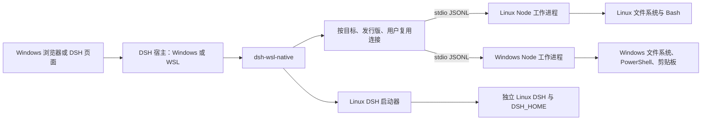

# 架构说明

## 两种宿主

Windows 宿主通过 `wsl.exe --exec` 启动 Linux Node。WSL 宿主操作当前 Linux 系统时直接使用 Node 子进程；操作 Windows 时通过 WSL 互操作执行 `node.exe`。工作进程是构建后的单文件模块，由标准输入引导加载，不要求向目标系统安装单独的 npm 桥接包。

每个目标、发行版和 Linux 用户组合最多保留一个连接；首次并发请求共享同一次连接建立。Windows 目标忽略无关的发行版键，避免重复创建 Windows 工作进程。连接按需创建，最多 8 个。

工作进程握手返回实际用户名，已经建立的默认用户连接可被同一用户的显式名称复用。每次命令、路径转换和分块复制在开始时固定发行版、用户及默认目录，之后的设置变更不会改变这次操作的目标。后台任务记录原环境；按 ID 查询、取消时使用原连接身份。

## 环境切换与并行使用

Windows 和 Linux 是两个同时可用的完整 DSH 宿主，保留各自的原生工具、会话和账号配置。切换通过 DSH 的已认证本机 Web 入口导航，分窗口时两个页面保持独立连接。插件没有替换 Windows 的核心工具，也没有热迁移正在生成的模型上下文。

配置切换按请求顺序执行：确定目标用户、连接、转换路径、解析真实目录并验证读取权限，最后写入临时文件并重命名提交。前面任何步骤失败，活动设置和历史均不变。每个环境记录最多 10 个最近目录，总计最多 32 个环境。

控制器按发行版和用户管理启动器；启动器持有固定身份的服务作用域，与主服务共享常驻连接。进入时先复用已运行实例，必要时才准备和启动。长操作归插件生命周期所有，前端仅保存自己的请求 ID 并观察状态，因此刷新不会重放安装。停止、断开及卸载才回收所属进程。

进入链接携带工作目录和本机返回来源，使用该 Linux 实例的随机密钥进行 HMAC-SHA-256 签名，24 小时有效。Linux 宿主通过已认证的 `environment/adopt` 接口验证后才应用目录。签名密钥只经子进程环境传递，不返回浏览器或写入设置文件。父页面来源允许本机 HTTP(S) 和精确的 `dsh-app://app`；Linux 服务器目标仍限本机 HTTP(S)。独立 Linux 浏览器页面返回桌面端时使用官方 `dsh://open` 协议。

前端通过官方 `workspaces.create` 和 `uiWorkspace.openSession/openWorkspace` 打开项目。使用公开的会话列表记录每个目录上次查看的会话；已删除或归档的会话不参与恢复。未记住会话时选择项目最近更新的可见会话，没有可用会话时通过 DSH 创建。不会复制其他宿主的会话数据库或密钥。

## 通信与资源上限

协议为带请求 ID 的 JSONL，帧上限 2 MiB。客户端最多保留 32 个待完成请求，工作进程最多并行处理 16 个。输出管道持续排空，写入队列有上限，避免大输出阻塞和无限增长。

请求超时或被取消时发送 `$cancel`，等待工作进程清理。Linux 使用独立进程组结束子进程树，Windows 使用目标 PID 的进程树终止。工作进程退出后连接失效，下一次调用可以重新建立连接；当前失败请求不会自动重试，因为命令或文件操作可能已经产生了效果。

命令默认各自启动 Bash／PowerShell，并显式设置 cwd 和 env。常驻的是桥接进程，不是共享可变状态的 shell；因此多个调用之间不会通过 `cd` 和变量互相污染。Windows 长脚本使用临时 UTF-8 BOM 的 ps1 文件执行，并在结束时清理。

工作进程收到输入 EOF 后取消前台请求、结束后台任务、清理未提交传输和释放它持有的运行锁。强制杀死工作进程、系统崩溃和断电无法运行清理代码，残留处理见故障说明。

## 文件一致性

文本写入与二进制传输共用提交逻辑：解析真实目标，检查旧 hash，在目标目录创建随机临时文件，按顺序写入分块，核对总 SHA-256，同步文件，重新检查目标 hash，最后重命名提交。

复制同时检查源文件大小和 mtime，在读取期间发生可观察变化时放弃提交。文件传输采用固定大小的块，内存使用不会随整个文件大小增长。已经进入工作进程的请求仍受帧和并发上限约束。

原子重命名保证正常运行中读者不会看到半个目标文件；它不等于完整断电持久性保证。外部进程不受本插件的内存锁约束，修改者没有保留 mtime 时，也不能仅靠大小和 mtime 检查发现所有变化。需要严格快照时，应先冻结源文件或从文件系统快照复制。

## DSH 集成

宿主入口通过官方 `defineTool` 注册工具，通过官方 `sandboxPolicy` 和 `approval` 服务处理跨系统执行与变更。模型工具结果使用统一 JSON 输出形式。

浏览器面板通过 DSH `connection.rpc.call('/api', ...)` 调用宿主注册的精确 Fetch 路由，复用 DSH 的认证、同源检查和连接通道。保留的 `/dsh-wsl-native/*` HTTP 接口还限制本机 Host／Origin，并要求变更请求带实例 CSRF 令牌。插件不额外建立 TCP 命令执行服务。

客户端通过 `sidebar.panellist` 注册原生侧边栏入口，通过 `main` 注册管理页面。React 和 `@deepseek-ai/dsh-client-ui-primitives` 使用宿主提供的模块；构建不重复打包它们。页面使用 DSH 主题变量及原生 Button、Input、Modal、StateDot，CSS 限定在插件组件内。长操作仅在页面打开时轮询进度；卸载时清理样式、计时器和连接事件订阅。

DSH API 仍处于预览阶段，因此 peer dependency 固定为 `0.2.0-rc.2`。升级上游时需要重新验证工具 schema、标准 Agent 可见性、批准服务和客户端加载方式。

## 独立 Linux DSH

### 同窗口对话

Windows 端注册统一 `sidebar.workspaces` 视图及一个 `main` 对话区域。用户可以撤销该视图，恢复 DSH 原生工作区浏览器；不修改其工作区记录和会话数据。Linux 的完整原生客户端驻留在 `shell.overlay` 下，几何位置跟随主区域，切换 Windows 对话时隐藏并设为不可交互，保持进程、页面和输入状态。Web 使用 iframe；Desktop 使用 DSH 官方隔离 webview。

Web iframe 加载本机 Linux DSH 的认证入口。签名工作区链接验证通过后，Linux 客户端才启用嵌入通信。每个页面持有独立随机通道；两端同时检查 `event.origin`、`event.source` 和协议标识，发送时指定精确目标来源，遵循 [postMessage 的来源校验要求](https://developer.mozilla.org/en-US/docs/Web/API/Window/postMessage#security_concerns)。消息与文件操作仍直接访问 Linux 宿主，跨页面只交换有限的导航元数据和允许的会话管理请求。

会话列表键包含宿主、发行版、用户和会话 ID，防止同名 ID 相互覆盖。一次导航结束前禁用对应嵌入区域的输入；快速连续导航保留最后一次选择。事件合并后才发送列表，最多传递 5,000 条摘要，界面按 35 条逐步显示。最多保留 8 个 Linux 页面，用户可单独关闭页面以释放内存，不停止后台任务。请求超时后报告失败，不自动重放新建或归档操作。

### Desktop 隔离容器

Desktop 的顶层页面为 `dsh-app://app`。Linux DSH 登录使用 `HttpOnly; SameSite=Strict` Cookie，直接跨站嵌入会影响认证。0.4.0 通过 `window.dshDesktop.browser.acquire` 申请官方容器，将返回的 `lease` 和 `partition` 用于 webview，先加载官方允许的 `about:blank#<lease>`，待初始化完成后加载 Linux 登录入口。容器中的 Linux DSH 拥有独立顶层文档及 Cookie 存储。

Linux 插件完成签名验证后，暴露只读的 `__DSH_WSL_DESKTOP_V1__` 接口。Windows 插件使用固定调用模板访问它，检查页面的精确本机来源、根路径及随机通道，参数用 JSON 编码，只允许导航、主题、侧栏、置顶和归档等固定操作。外部导航不能继续接收会话管理请求。请求失败后不自动重放。

会话目录变化唤醒等待中的请求；空闲等待最长 20 秒，只保留最新目录和最多 16 条界面信号。容器在环境切换时保持驻留，卸载时移除页面并释放官方 lease；异步申请晚于卸载完成时也立即释放。整个过程保留 DSH 强制的 sandbox、contextIsolation 和 webSecurity，不修改 Electron 程序包或宿主安全策略。

适配依据是[官方 Desktop 实现](https://github.com/deepseek-ai/deepseek-harness/blob/master/apps/desktop/src/browser-guests.ts)。本机安装版 0.2.0-rc.2 已确认包含这些接口；真实运行时检查与原生 GUI 验收的范围见[验证报告](validation.md)。

### 安装与生命周期

`setup` 将插件按内容哈希复制到 Linux runtime 下，全部文件写完后才标记快照完整；相同完整快照复用，未完成的快照重新复制。Windows 辅助下载流程在临时目录生成依赖锁文件，筛选 Linux 架构和 glibc 包，使用已有 npm 缓存分批下载；Linux 用相同锁文件完成安装。它不修改 npm 全局 registry、代理或 DNS。

启动器固定使用托管的 Linux CLI 路径，避免误调用 Windows 挂载盘中的全局 `dsh`。端口默认自动选择，只监听 `127.0.0.1`，启动后检查 Windows 侧是否能访问 DSH 的认证入口。WSL 转发尚未就绪时最多等待 15 秒，期间响应取消信号；不会更改网络配置。

同一托管目录由 `runtime.lock` 互斥保护，阻止两个启动器同时安装或启动同一数据目录。锁由常驻工作进程持有，在正常退出或连接 EOF 时释放。每个用户和发行版有独立安装目录。

## 源码分工

| 文件 | 责任 |
| --- | --- |
| `src/index.mjs`、`src/policy.mjs` | 官方工具注册与批准服务 |
| `src/service.mjs` | 设置、路径归一化、双向复制和统一调用 |
| `src/connector.mjs`、`src/rpc.mjs` | 引导加载、连接池、协议和取消 |
| `src/worker.mjs`、`src/process.mjs`、`src/encoding.mjs` | 两端进程、文件、任务、文本解码 |
| `src/launcher.mjs`、`src/install-cache.mjs` | 安装、缓存下载、启动与停止 |
| `src/routes.mjs` | 管理接口 |
| `src/client.jsx`、`src/page.jsx`、`src/components.jsx`、`src/client.css` | 原生侧边栏页面、目录弹窗与主题样式 |
| `src/client-session.mjs` | 页面状态、工作区打开和会话恢复 |
| `src/conversations.jsx`、`src/conversation-model.mjs` | 统一对话列表、常驻页面、导航与页面生命周期 |
| `src/conversation-guest.mjs`、`src/conversation-protocol.mjs` | Linux 页面通信、来源验证、有限元数据投影 |
| `src/desktop-view.mjs`、`src/desktop-mailbox.mjs` | Desktop 官方容器、固定操作通道与元数据变化通知 |
| `src/handoff.mjs`、`src/handoff-auth.mjs` | 切换链接、本机来源限制与实例签名 |
| `src/localhost.mjs` | 启动后等待本机转发就绪 |
| `src/cli.mjs`、`bin/dsh-wsl.mjs` | 命令行入口 |

客户端产物保留在 `lib/client.js`，工作进程产物保留在 `lib/worker.mjs`。发布包无需在用户机器上现场构建。
