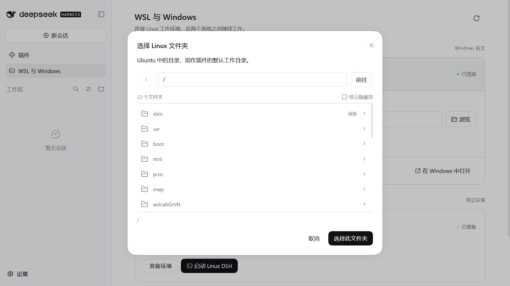

# 使用手册

Windows 桌面端的安装、更新和卸载见[桌面端说明](desktop.md)。桌面端使用 `desktop` 配置，浏览器宿主使用 `web` 配置；两者需要分别安装。

## 选择运行方式

Windows DSH 与 Linux DSH 可以同时运行。Windows 项目继续在 Windows DSH 中工作；Linux 项目从面板进入完整 Linux DSH，并放在 Linux 文件系统中。两边分别保留账号配置、会话、终端和文件工具。

Windows DSH 模式保留原有工作区，模型需要调用新增的 `wsl_native_*` 工具操作 Linux。完整 Linux DSH 模式中，DSH 原生文件、Bash 和工作区服务也运行在 Linux；访问 Windows 时调用新增工具的 `windows` 目标。

## 管理页面

点击 DSH 侧边栏中的 **WSL 与 Windows**。页面与 DSH 共用颜色、字体、按钮和弹窗，主题在 DSH 的“设置 → 通用设置 → 外观”中切换。

### 同一个窗口中的两种对话

0.4.0 在 Windows Desktop 和 Windows Web 中使用统一对话列表。Windows 对话保持普通样式，Linux 对话在右侧显示 `WSL` 标志；鼠标停留可查看发行版和完整路径。点击对话时，主区域直接显示所属环境的原生 DSH 对话，不跳转地址。两边的未发送草稿、工具输出、文件侧栏和运行中任务分别保留。

- **Windows ＋**：新建 Windows 对话，使用 Windows 当前工作区；DSH 顶部原有“新会话”同样创建 Windows 对话。
- **WSL ＋**：在当前 Linux 项目中新建对话；没有打开 Linux 页面时使用环境面板保存的目录。
- **全部／Windows／WSL**：筛选对话，搜索框匹配标题、目录与发行版；不检索消息正文。
- **对话菜单**：置顶、取消置顶、归档、恢复；正在运行的对话仍由 DSH 判断是否允许归档，不自动终止任务。
- **工作区**：切回 DSH 完整的原生工作区列表，保留其分组、排序、重命名、分支等操作。可在“WSL 与 Windows”面板重新启用统一列表。
- **Linux 设置**：在主区域展开 Linux DSH 自己的侧栏，操作其模型账号、插件、工作区；完成后点击“收起侧栏”。

在宽度不超过 600 像素的窗口中，选择或新建对话后自动收起列表，腾出输入区域。新建对话时会清空列表搜索并返回当前对话列表，避免新对话被旧筛选条件隐藏。

同一窗口最多保持 8 个 Linux 环境页面。对话菜单中的“关闭这个环境的页面”释放对应页面占用，保留对话记录和后台任务。刷新整个窗口会重新建立页面连接；连接中的对话无需每次切换都加载。只把导航所需的标题、目录、运行状态等元数据交给 Windows 列表，消息和密钥留在各自宿主。


### 环境面板与独立窗口

页面顶部显示 Windows DSH 和 Linux DSH 两张卡片，标明当前环境及 Linux 的就绪状态。

| 操作 | 结果 |
| --- | --- |
| 开始 WSL 对话／打开 WSL 对话 | 自动完成准备、启动和连接，在当前窗口主区域打开所选 Linux 项目 |
| 同时打开 | 为 Linux 打开另一个窗口，Windows 页面继续可用；浏览器阻止弹窗时会提供就绪后的链接 |
| 新窗口打开 | 在另一个页面打开已运行的环境；具体窗口或标签页形式由浏览器决定 |
| 切换到 Windows／侧边栏底部返回按钮 | 返回启动它的 Windows DSH，Linux DSH 保持运行 |
| 继续 Windows 会话 | 回到 Windows DSH 当前选中的会话 |
| 继续 Linux 会话 | 打开所选目录的 Linux 工作区，优先恢复该项目上次查看的会话 |

Linux DSH 已运行时会复用同一实例，不重复安装和启动。第一次进入会自动复制插件并准备依赖；首次模型账号配置仍在 Linux DSH 自己的界面完成。自动进入工作区的链接由启动实例签名，24 小时有效；启动器重启后应从面板重新进入。

Windows 与 Linux 的模型对话分别保存。切换不会把进行中的推理、未发送输入或终端进程迁移到另一个系统。统一窗口保持两边页面的状态；希望使用独立窗口时仍可选择“同时打开”。多个页面可以同时查看自己的工作区；编辑同一文件时仍需处理内容冲突。

### 连接和工作目录

1. 选择 WSL 发行版。首次使用发行版的默认用户，之后恢复记住的用户和目录；需要指定用户时展开“高级设置”。
2. 输入 Linux、Windows 或 WSL UNC 绝对路径，或点击“浏览”。目录为空时使用 Linux 用户主目录。
3. 点击“应用工作目录”或“连接 WSL”。也可以直接点击“开始 WSL 对话”，一次完成目录保存与启动。

切换发行版、点击最近目录，或在弹窗中点击“选择此文件夹”会直接连接验证并保存。每个发行版和用户分别保留最近 10 个目录，页面显示前 5 个；目录不存在或无权访问时，原设置保持有效，输入保留供修改。浏览弹窗支持返回上级、隐藏项、按名称排序和分页加载，不扫描整个目录树。



“在 Windows 中打开”通过资源管理器打开所填目录。这里的目录也是插件工具的默认目录；点击进入 Linux 或继续 Linux 会话时，插件通过 DSH 官方接口打开对应工作区。Windows 原有会话的工作区不受此设置影响。各个会话调用桥接工具时，可明确传入 `distro`、`user`、`cwd`，避免依赖整个宿主共享的默认设置。

### 获得接近原生 Linux 的工作方式

完整 Linux DSH 的本体、插件快照、依赖和数据目录均在 Linux 文件系统中。把项目放在 `/home/<用户>/projects/...`，可以由 Linux 原生工具直接处理文件、Git、依赖安装、构建与文件监听。实测保留了大小写敏感文件名、符号链接和可执行权限。

`C:\...` 转成的 `/mnt/c/...` 目录仍由 Windows 文件系统承载。面板识别这类挂载目录并显示说明；自动转换路径不会把文件搬进 Linux。需要 Windows 文件时可以直接访问，或使用复制工具把明确选择的文件传过去。插件不会自动搬动整个项目或同步依赖目录。

### 管理运行中的环境

“运行与连接管理”显示版本、连接和 Linux 实例。每个发行版、用户有独立启动器；切换设置时，已经开始的命令、复制和后台任务仍归原环境所有。准备过程由宿主继续执行，关闭面板或刷新页面不会重新安装；再次打开面板可以查看进度。

“停止此环境”只停止对应 Linux DSH，其他环境继续运行。“断开全部连接”会结束桥接任务和本插件启动的 Linux DSH，两者均会先说明影响。日常切换无需停止或断开。

从面板启动的 Linux DSH 随 Windows DSH 插件的生命周期管理。退出 Windows DSH、卸载插件或断开连接会停止其管理的 Linux 实例；仅关闭或切换浏览器页面不会停止 Windows Web 宿主。需要单独管理 Linux 实例时，可以采用下面的命令行入口并保持该终端运行。

## 命令行

以下 `dsh-wsl` 也可写成 `node C:\path\to\dsh-wsl-native\bin\dsh-wsl.mjs`。

| 命令 | 用途 |
| --- | --- |
| `dsh-wsl list` | 列出发行版；过滤 Docker 内部发行版 |
| `dsh-wsl status` | 查看宿主、设置和连接状态 |
| `dsh-wsl doctor --distro Ubuntu` | 实际连接 Linux、Windows，检查运行时平台 |
| `dsh-wsl exec --command "uname -a" --distro Ubuntu` | 执行 Linux 命令 |
| `dsh-wsl exec --target windows --command "Get-Date"` | 执行 Windows PowerShell |
| `dsh-wsl path --path "C:\Work" --direction linux` | 使用实际挂载规则转换路径 |
| `dsh-wsl setup --distro Ubuntu` | 安装独立 Linux DSH 并复制插件 |
| `dsh-wsl start --distro Ubuntu --cwd /home/me/project` | 启动 Linux DSH，打开 Windows 浏览器 |

通用参数：`--distro`、`--user`、`--linux-node`、`--windows-node`、`--json`。`exec` 支持 `--cwd`、`--timeout`；`start` 支持 `--port`、`--no-open`。端口默认为 `0`，由系统选择空闲端口。

`setup` 参数：

| 参数 | 行为 |
| --- | --- |
| `--install-network auto` | Windows 宿主使用 Windows 下载、Linux 安装；WSL 宿主直接在 Linux 安装 |
| `--install-network windows` | 强制 Windows 辅助下载，需要从 Windows 执行 |
| `--install-network linux` | Linux npm 直接下载和安装 |
| `--npm-cache "F:\npm-cache"` | 指定 npm 缓存目录；Windows 默认读取本机 npm 缓存设置 |
| `--reinstall` | 重新安装托管的 DSH 依赖，保留独立 DSH 数据目录 |

`exec` 透传程序退出码；超时返回 `124`，取消返回 `130`。`start` 在前台持有实例，关闭终端或按 `Ctrl+C` 会停止其 Linux DSH。它不是登录后常驻服务。

## 工具接口

工具结果为 JSON，展示为文本。默认目标为 `wsl`。`distro`、`user` 默认采用该环境保存的值，`cwd` 默认采用对应 Linux 目录；未设置目录时使用目标用户的主目录。显式传入 `user: ""` 可使用发行版的默认用户。

| 工具 | 主要参数 | 返回内容 |
| --- | --- | --- |
| `wsl_native_status` | 无 | 宿主、发行版、设置、已启动的连接；不主动启动发行版 |
| `wsl_native_exec` | `target`、`distro`、`command` 或 `executable`+`args`、`cwd`、`env`、`timeoutMs` | 退出码、stdout、stderr、超时／取消状态、输出字节数、耗时 |
| `wsl_native_files` | `operation` 为 `list/read/write/stat`，加 `path` | 目录分页、文本内容、大小、mtime 或 SHA-256 |
| `wsl_native_copy` | `from`、`to`、`source`、`destination`、`distro`、`expectedHash` | 提交后的文件路径、大小、SHA-256 |
| `wsl_native_path` | `path`、`direction` 为 `linux/windows`、`distro` | 实际转换后的路径 |
| `wsl_native_windows` | `action` 为 `open/clipboard_get/clipboard_set`，加 `target` 或 `text` | 打开结果或剪贴板文本／字节数 |
| `wsl_native_job` | `action` 为 `start/status/cancel/forget`，加 `target`、`distro`、`id`、`command`、`cwd`、`timeoutMs` | 任务 ID、状态和输出 |

### 命令与后台任务

前台工具默认超时 120 秒，最大 10 分钟。后台工具最大 24 小时。需要保存 shell 状态或交互式终端时，使用完整 Linux DSH 的原生终端；本插件的每次命令均独立，前一次 `cd`、变量赋值不会影响下一次。

直接程序调用保留参数原样，不经过 shell 拼接：

```json
{
  "target": "wsl",
  "distro": "Ubuntu",
  "executable": "/usr/bin/node",
  "args": ["-e", "console.log(process.argv[1])", "中文、空格与 $() 都作为文字"],
  "cwd": "/home/me/project",
  "timeoutMs": 30000
}
```

`command` 是 Bash 或 PowerShell 脚本，应按目标 shell 编写。stdout 和 stderr 默认各保留前 64 KiB，超过后继续排空管道并返回 `truncated: true`。后台状态另外保留最新 32 KiB 左右的输出尾部；长日志应写入目标系统文件，再分页读取。

后台任务 ID 只在当前连接存活期间有效。开始任务会返回所属 `target`、`distro` 和 `user`。按 ID 查询时，插件会使用记住的原环境；显式传入另一个环境会返回 `JOB_ENVIRONMENT_MISMATCH`。同一个宿主的会话共享连接，任务没有按会话隔离。断开连接、插件卸载或宿主退出会终止所属任务。

### 文件读写和复制

- `read` 的 `offset`、`limit` 使用字节，单次最大 256 KiB；使用返回的 `nextOffset` 继续。文本分页保留完整字符，错误编码不会静默替换乱码。
- `list` 的 `offset` 使用条目序号，`limit` 最大 1000；目录项采用文件系统枚举顺序，目录变化时不提供快照一致性。
- `write` 接受最大 512 KiB 的 UTF-8 文本；父目录必须存在。传入 `expectedHash: "absent"` 表示只新建，传入旧 SHA-256 表示冲突时拒绝覆盖。省略 `expectedHash` 允许覆盖。
- `copy` 每次传输 256 KiB，单文件最大 1 GiB；默认 `expectedHash: "absent"`。覆盖已有文件时先读取目标 SHA-256。
- 写入跟随已有符号链接，将内容原子替换到真实目标；不会把链接本身替换成普通文件。旧文件的 POSIX 权限位会保留，ACL、所有者、扩展属性和 NTFS 附加元数据不做完整复制。
- SHA-256 检查和本连接中的写入锁用于避免常见覆盖冲突；外部程序仍可在检查与提交之间修改同一路径，不能当作跨程序事务锁。

跨系统复制示例：

```json
{
  "from": "wsl",
  "to": "windows",
  "distro": "Ubuntu",
  "source": "/home/me/project/report.pdf",
  "destination": "C:\\Users\\me\\Desktop\\report.pdf",
  "expectedHash": "absent"
}
```

`path` 工具识别 `C:\...`、`/home/...`、`\\wsl.localhost\Ubuntu\...` 和 `\\wsl$\Ubuntu\...`。路径中的发行版与已选发行版不一致时会拒绝处理。Windows 设备路径和 NTFS 备用数据流不在支持范围内。

## 权限

Windows 与 Linux 属于不同的权限环境。插件的跨系统命令、写入、复制、后台任务变更、打开操作和剪贴板读取／写入，检查 DSH 的 `sandboxPolicy`：完全访问模式直接执行；其他模式通过 DSH 官方批准服务请求一次批准，拒绝或缺少批准服务则不执行。

文件读取、目录列表、路径转换和状态查询使用目标系统当前用户的读取权限。管理面板由用户直接操作，使用 DSH 已登录的连接接口。完整 Linux DSH 的原生工具继续遵循它自己的权限设置。

## 配置

面板设置保存在 `<DSH_HOME>/dsh-wsl-native/settings.json`；未指定 `DSH_HOME` 时使用 `~/.dsh`。配置包含当前发行版、用户、目录，以及最多 32 个环境的最近目录记录，没有认证密钥。兼容 0.1.0 的三个字段，历史记录由新版自动补齐。Windows 宿主可切换发行版和用户；WSL 宿主仅使用当前发行版、当前用户。

```json
{
  "distro": "Ubuntu",
  "user": "",
  "directory": "/home/me/project"
}
```

插件配置还支持 `linuxNode`、`windowsNode`、`settingsFile`。`linuxNode` 是发行版中的 Linux 可执行文件，例如 `/usr/bin/node`；`windowsNode` 是 WSL 可以执行的 Windows Node 路径，例如 `/mnt/c/Program Files/nodejs/node.exe`。

WSL 反向连接优先读取 `windowsNode`，再读取环境变量 `DSH_WSL_WINDOWS_NODE`，最后尝试 `node.exe`。启动器从 Windows 启动 Linux DSH 时自动设置反向连接路径。

完整 Linux DSH 的目录：

```text
~/.local/share/dsh-wsl-native/
├── runtime/                  # Linux npm 安装的 DSH
│   ├── node_modules/
│   ├── plugins/<内容哈希>/    # 插件快照
│   ├── plugin.patch.json     # 本启动器的插件加载配置
│   └── .dsh-wsl-ready.json   # 已完成安装的版本
├── dsh-home/                 # 账号、会话与 DSH 配置
└── runtime.lock              # 当前启动器持有的互斥文件
```

旧插件快照保留以便排查与恢复。升级不会自动清理历史会话。桌面端卸载使用其内置 CLI 执行 `dsh plugin --profile desktop remove dsh-wsl-native`；Web 配置改用 `--profile web`。清理托管的 Linux 目录前先停止实例，并自行备份其中的 `dsh-home/`。
