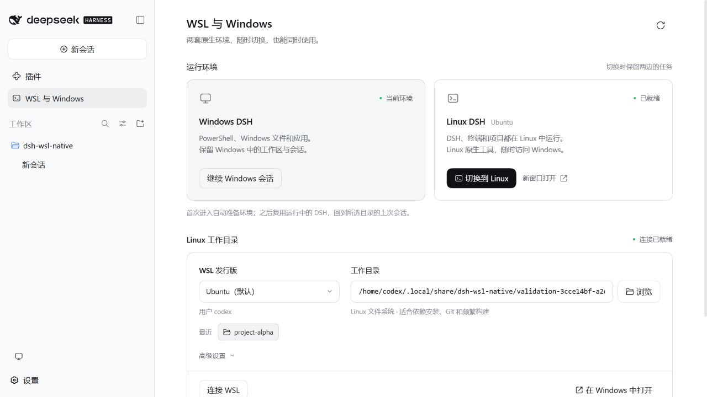
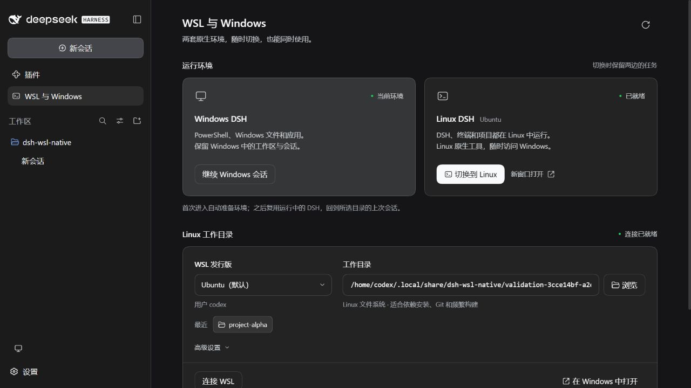

# 验证报告

验证日期：2026-09-30。插件版本：**0.2.0**。适配 DeepSeek Harness **0.2.0-rc.2**。

## 实际环境

| 项目 | 环境 |
| --- | --- |
| Windows | Windows 原生 DSH Web 宿主、Node.js v24.19.0、x64 |
| Linux | Ubuntu、WSL 2、Node.js v22.22.1、x64 |
| Linux DSH | Linux 文件系统中的独立 runtime 与 DSH_HOME |
| 项目文件 | Linux ext4、Windows 挂载目录及独立临时测试目录 |
| 网络 | 既有 localhost 转发；测试未更改代理、防火墙或 WSL 网络设置 |

检查没有调用模型 API。标准 Agent 由 DSH 会话服务创建，工具由实际工具服务调用；这覆盖插件加载、工具可见性和执行链路。浏览器检查使用实际宿主与真实文件路径。

## 自动化检查

最终 `npm test`：**37 项通过，0 失败，0 跳过**。源码语法和客户端构建检查通过。客户端为 **43,962 字节**，低于 DSH 的 262,144 字节上限，React 与 DSH 控件由宿主提供。

| 范围 | 数量 | 覆盖内容 |
| --- | ---: | --- |
| 协议、进程、文件与权限 | 24 | 分包、粘包、编码、参数传递、取消、进程树、原子写入、二进制校验、运行锁、批准服务、7 个工具注册 |
| 启动等待 | 2 | localhost 延迟就绪、等待期限与取消 |
| 环境与切换 | 11 | 验证失败回退、历史持久化、并发切换顺序、在途操作身份、后台任务归属、启动器作用域、Windows 独立执行、多宿主复用、本机地址、目录解析、切换签名 |

`scripts/wsl-smoke.mjs`：**10 项真实 WSL 检查通过**，包括中文参数、符号链接、3,145,759 字节二进制文件双向往返和 SHA-256、真实路径转换、取消后连接复用、反向 PowerShell 调用、SIGTERM 后任务与锁清理。

`scripts/switch-smoke.mjs`：**7 项真实环境检查通过**：

1. Linux 上可同时存在 `Case.txt` 和 `case.txt`，符号链接和 0755 权限有效，文件监听收到真实变更事件。
2. 在目录 A 启动的后台任务，在默认目录切换到 B 后仍报告目录 A。
3. 后续命令使用目录 B。
4. Windows 原生命令仍报告 `win32`，Linux 命令报告 `linux`。
5. 不存在的目录被拒绝，原活动目录保持有效。
6. Windows 路径被转换，并识别为 Windows 挂载文件系统。
7. 默认用户与其显式用户名复用同一个 Linux 工作进程 PID。

## 两个 DSH 同时运行

| 检查 | 结果 |
| --- | --- |
| Windows DSH 实际加载 7 个插件工具 | 通过，原有 `pwsh`、文件工具仍在标准 Agent 中 |
| 完整 Linux DSH 实际加载 7 个插件工具 | 通过，标准 Agent 反向读取 Windows 测试文件成功 |
| Windows、Linux 认证接口同时可访问 | 通过 |
| Linux DSH 通过桥接连接 Windows | 通过 |
| 再次进入复用同一 Linux 实例 | 通过，后台任务 ID 保持不变 |
| 被修改的工作区切换链接 | 返回 `HANDOFF_INVALID`，目录设置不被修改 |
| 未登录请求和缺少 CSRF 的管理请求 | 拒绝 |

签名加入后，实际 Windows → Linux → Windows 往返再次通过。最终一次已运行实例的进入接口耗时 **31.0 ms**；Linux DSH 未运行、依赖已安装时，准备并启动耗时 **6,178 ms**。两者均为服务器计时，不包括浏览器页面渲染、首次依赖下载或 WSL 发行版冷启动，不作为通用时延保证。

测试退出曾因测试脚本强制终止宿主留下运行锁。核对记录的 PID 已退出、该 runtime 没有 DSH 进程后，仅移除了该测试实例的锁；测试脚本已改为先通过认证接口停止所属实例，再关闭宿主。产品的强制终止与断电限制仍适用。

## 界面与恢复

在实际 DSH 页面中完成以下操作：

- 一次点击自动准备、启动、进入 Linux，并自动打开 `project-alpha` 工作区。
- 返回 Windows 后，原来的 Windows 工作区、会话和未发送的测试草稿仍在。
- 两个浏览器页面分别连接 Windows 与 Linux；切换到 `project-beta` 时，另一 Linux 页面仍显示 `project-alpha`。
- 输入无效目录后显示中文原因，原 Linux 实例保持运行；更正目录后继续使用。
- DSH 原生侧边栏、按钮、弹窗及浅色、深色主题正常显示。
- 420 × 820 窄窗口中，页面宽度与滚动内容宽度均为 359 像素，文档宽度为 420 像素，无横向溢出。
- 最终浏览器检查未观察到前端警告或错误日志。主题及临时窗口尺寸在检查后恢复。

目录弹窗的上下级浏览、隐藏项、220 个目录分页和错误恢复已在 0.1.0 界面轮次验证；0.2.0 保留该实现，补充用户身份参数和已加载目录的名称排序。

## 短命令性能

方法：在已经启动的 Ubuntu 中建立桥接，交错执行 30 轮相同的 `/bin/true`；对照为每次新启动一次 `wsl.exe --exec /bin/true`。另测 30 次常驻 ping。

| 项目 | 中位数 | P95 |
| --- | ---: | ---: |
| 常驻桥接短命令 | 4.601 ms | 100.012 ms |
| 每次新建 wsl.exe | 289.644 ms | 1,156.727 ms |
| 常驻连接 ping | 0.616 ms | 1.048 ms |

首次连接为 913.428 ms，桥接工作进程启动 1 次。采样发生在 DSH 界面验证期间，后台负载没有隔离；中位短命令开销比约为 62.95，不代表模型推理、编译或整个 DSH 的加速倍数。复现命令为 `npm run bench:wsl`。

## 可复现材料

| 文件 | 用途 |
| --- | --- |
| `test/core.test.mjs` | 协议、进程、文件与权限 |
| `test/localhost.test.mjs` | 本机转发等待 |
| `test/environments.test.mjs` | 环境隔离、目录记忆、启动复用与签名 |
| `scripts/wsl-smoke.mjs` | 真实 WSL 传输与进程检查 |
| `scripts/switch-smoke.mjs` | Linux 文件行为与切换中的任务 |
| `scripts/host-smoke.mjs` | Windows DSH 的工具、工作区及认证接口 |
| `scripts/native-host-smoke.mjs` | 完整 Linux DSH 和标准 Agent 反向调用 |
| `scripts/parallel-host-smoke.mjs` | 两个运行中的 DSH、实例复用及篡改拒绝 |
| `scripts/benchmark.mjs` | 30 轮交错性能比较 |
| `scripts/package-smoke.mjs` | 最终 tgz 在源码目录之外经官方插件命令安装 |

原始结果在源码目录的 `.test-output/`，可分发的结果副本在 `docs/evidence/`。认证 URL、测试宿主的数据目录、私有日志和依赖缓存不打入 npm 包。

0.2.0 安装包已通过官方 `dsh plugin` 命令安装到源码目录外的独立配置，Windows 宿主加载和认证接口检查通过。安装包的 SHA-256 与最终验证记录随 `dist/` 提供。`docs/evidence/ui-review.json` 标记为 0.1.0 历史记录，当前界面证据见 `ui-v020.json`。

## 验证边界

- 已实测 Windows 原生 Web 宿主与 Ubuntu WSL 2；Windows Desktop 打包安装版窗口、ARM64、其他发行版、WSL 1 和 Alpine／musl 未实测。
- 多发行版和多用户启动器隔离有自动化检查；本机实机验证使用 Ubuntu 当前用户。
- 没有执行付费模型调用、24 小时耐久测试或剪贴板覆盖测试。
- 关闭、切换页面保留宿主任务；强制杀进程、断电及宿主退出的范围见使用手册与故障处理。
- 未向远程仓库推送，不声称远程 CI、GitHub Release 或 npm 发布已经完成。
