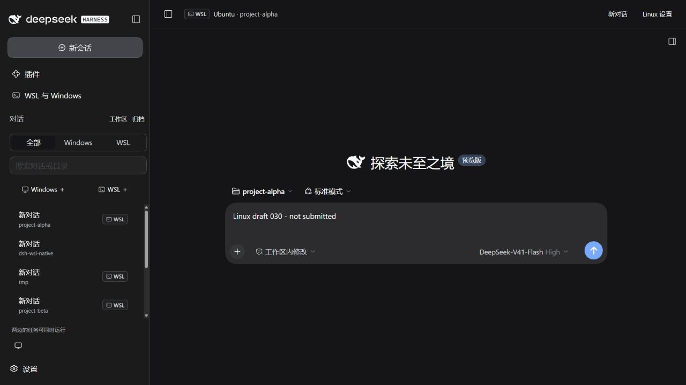

# 验证报告

验证日期：2026-09-30。当前插件版本：**0.3.0**。适配 DeepSeek Harness **0.2.0-rc.2**。

## 实际环境

本轮使用 Windows 原生 DSH Web 宿主、Node.js v24.19.0，以及 Ubuntu WSL 2 中完整的 Linux DSH、Node.js v22.22.1。两端都是 x64；Linux 项目、DSH 及其依赖位于 Linux 文件系统。测试使用独立的 DSH_HOME，没有修改用户现有账号或全局 WSL、网络设置。

## 同窗口对话

以下操作在运行中的真实 Windows 和 Linux DSH 页面完成。浏览器的顶层地址始终属于 Windows 宿主，WSL 原生对话在同一个窗口的主区域显示。

| 检查 | 结果 |
| --- | --- |
| Windows 与 WSL 同一个对话列表 | 通过，WSL 行带标志；Windows 行保留普通样式 |
| 点击列表往返切换 | 通过，顶层地址不变，已有 Linux 页面不重建 |
| 两端未发送草稿 | 通过，真实键盘输入后往返，内容分别保留；检查后清空测试输入 |
| 新建 WSL 对话 | 通过，真实 Linux 项目增加一条会话，Windows 会话数量不变 |
| 新建 Windows 对话 | 通过，打开 Windows 原生新会话输入区，并退出搜索和归档筛选 |
| WSL 置顶、归档、恢复 | 通过，列表与所属宿主状态同步 |
| 环境筛选与目录搜索 | 通过，可分别显示 Windows、WSL 或匹配项目 |
| Linux 原生文件侧栏 | 通过，读出真实项目文件，包含同时存在的 Case.txt 与 case.txt |
| Linux 设置 | 通过，原生侧栏可在当前主区域展开和收起 |
| 深色主题 | 通过，Windows 和 Linux 的主题属性同步；检查后恢复跟随系统 |
| 420 × 820 窄窗口 | 通过，选择对话后自动收起列表；外层宽度与滚动宽度均为 420，内层均为 364，无横向溢出 |
| 页面刷新后重新打开 WSL 对话 | 通过，缓存列表可用，重新连接现有 Linux 宿主 |

没有调用模型 API。草稿保留、会话新建和文件显示是真实界面结果；本轮没有执行付费模型生成或长时间耐久测试。后台任务不因切换而停止，由既有宿主隔离设计和 0.2.0 的实机检查支持，历史记录见下方链接。

## 自动化与构建

本轮 `npm test`：**43 项通过，0 失败，0 跳过**。`npm run check` 通过。新增 6 项检查覆盖：签名与嵌入参数、本机来源限制、消息来源和窗口身份、随机通道、导航元数据过滤、跨宿主同 ID 会话隔离、列表筛选排序及官方会话数据映射。

最终界面微调后重新构建成功，客户端为 **74,699 字节**，低于 262,144 字节上限。React 与 DSH 控件由宿主提供。窄屏选中收起、新建时重置筛选已经在最终构建上检查。

本轮 Windows 宿主实际加载插件、7 个工具及认证 API，能够连接 Ubuntu。安装包使用 `scripts/package-smoke.mjs`，通过官方 `dsh plugin --profile web add` 安装到源码目录外的独立配置，再启动真实 DSH 验证认证接口。最终安装结果与 SHA-256 记录在源码交付目录的 `dist/verification-0.3.0.json` 和 `dist/SHA256SUMS`，不让 npm 包包含自身的校验结果。

## 历史验证与性能

[0.2.0 验证报告](validation-0.2.0.md)保留 10 项真实 WSL 传输检查、7 项 Linux 文件与环境切换检查、双宿主认证和 30 轮短命令性能测量。本轮主要修改客户端统一对话，不重复这些未受影响的性能与文件传输实验；历史数字不作为 0.3.0 的重新测量结果。

## 可复现材料

| 文件 | 用途 |
| --- | --- |
| test/conversations.test.mjs | 同窗口协议、来源检查、元数据与列表 |
| test/core.test.mjs | 协议、进程、文件与权限 |
| test/environments.test.mjs | 环境隔离、目录记忆、启动复用与签名 |
| test/localhost.test.mjs | 本机转发等待 |
| scripts/host-smoke.mjs | Windows DSH 的工具、工作区与认证接口 |
| scripts/package-smoke.mjs | 最终包在源码目录之外经官方命令安装 |
| docs/evidence/ui-v030.json | 本轮浏览器验证记录 |
| docs/evidence/summary.json | 当前版本检查汇总 |
| docs/evidence/summary-v020.json | 0.2.0 历史汇总 |

认证 URL、测试宿主数据、日志、临时安装目录和依赖缓存不打入 npm 包。原始本地输出在 `.test-output/`。

## 验证范围

完整同窗口流程已在 Windows DSH Web 与 Ubuntu WSL 2 中验证。Windows Desktop 打包安装版、ARM64、其他发行版、WSL 1、Alpine／musl 和八个环境同时驻留没有实机验证。多发行版与多用户的身份隔离有自动化检查，本机实测使用 Ubuntu 当前用户。

关闭环境页面和切换对话不结束宿主任务；退出 Windows DSH 或停止所管理的 Linux 实例会结束对应进程。操作范围见[使用手册](usage.md)。未向远程仓库推送，也未发布 GitHub Release 或 npm 版本。
