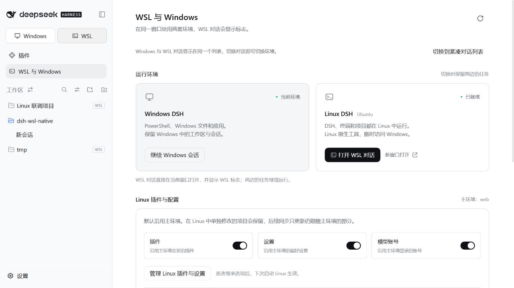

# 验证报告

验证日期：2026-10-01。当前插件版本：**0.6.1**。适配 DeepSeek Harness **0.2.0-rc.2**。

## 0.6.1 检查

- 69 项自动化检查通过，0 失败，0 跳过。
- 构建与语法检查通过；客户端 124,767 字节，上限 262,144 字节。
- 新增检查模拟已移除预设的旧空白会话，验证以当前默认值新建、并发合并、其他错误不重试、无效默认值只尝试一次、导航取消与最近工作区选择。
- 本次不重复执行未变更的文件传输、配置继承及跨环境交接界面流程；其实际宿主验证记录保留如下。
- 本机安装和发布包的检查结果随对应 GitHub Release 附件提供。

## 0.6.0 集成验证记录

| 检查 | 结果与范围 |
| --- | --- |
| 自动化检查 | 64 项通过，0 失败，0 跳过；Windows Node.js v24.19.0 |
| 语法与构建 | 通过；客户端 123,379 字节，上限 262,144 字节 |
| 原生工作区列表 | Windows Web 宿主与真实 Ubuntu WSL 2 联调；双新建按钮、原生文件夹图标、同行 WSL 标志、原生／紧凑视图切换 |
| Linux 工作区 | 界面创建中文目录并加入工作区；拖动到 Windows 工作区前；原生菜单重命名成功 |
| 双向交接草稿 | Windows → WSL、WSL → Windows 实际输入框收到文字；未调用模型 API |
| 草稿恢复 | WSL → Windows 交接后刷新，原生持久化草稿保留 |
| 交接发送机制 | 自动测试验证 queue 模式、并发合并、刷新后的回执去重；未发送真实模型请求 |
| 草稿保护 | 自动检查已有草稿和未挂载的持久化草稿不被覆盖 |
| 包加载 | 官方命令安装至源码目录外的隔离 profile，并检查认证 API、版本和官方 profileContext；结果见 package-v060.json |

界面联调使用随机命名的隔离 Windows profile 和隔离 Linux 数据目录。测试目录与用户的真实工作区分开。发布截图来自该隔离环境。



本轮没有逐项点击真实宿主中的归档、分支、移除及所有视图选项。这些操作通过原生组件和明确的环境路由实现，自动检查覆盖 ID 隔离、空工作区、排序、成员验证与命令分发。

## 复现

```powershell
npm ci
npm run build
npm run check
npm test
npm pack --pack-destination dist
npm run test:package
```

界面联调运行 `node scripts/host-smoke.mjs --keep`，再打开其 `.test-output/windows-host-url.txt` 中的本地认证链接。此链接不得公开。完成后创建 `.test-output/windows-host.stop`，脚本会关闭自身测试宿主。

## 历史结果

- [0.5.0](validation-0.5.0.md)：实际主环境插件、配置和账号文件继承，Linux 独立修改保留；没有调用模型 API。本版未重复未修改的继承路径。
- [0.4.0](validation-0.4.0.md)：Desktop 内置 Electron 运行时、精确来源与签名、完整 Linux DSH、反向 Windows 互操作和官方桌面配置安装。
- [0.3.0](validation-0.3.0.md)：同窗口切换、草稿、Linux 文件侧栏、深色主题、窄窗口与刷新恢复。
- [0.2.0](validation-0.2.0.md)：常驻短命令中位耗时 4.601 ms，每次启动 wsl.exe 为 289.644 ms。本版没有重复测量未修改的执行路径。

## 证据与范围

- [汇总](evidence/summary.json)、[本版界面联调](evidence/ui-v060.json)、[本版包加载](evidence/package-v060.json)。
- `test/workspaces.test.mjs`：原生工作区投影、跨环境排序、固定命令和交接保护。
- `scripts/install-desktop.ps1`：桌面配置备份、官方安装、原有插件保留检查。
- GitHub Release 附件 `verification-0.6.0.json` 记录最终包哈希和本机安装结果。

认证链接、账号、私有日志、用户配置备份和依赖缓存不发布。ARM64、其他发行版、WSL 1、Alpine/musl、八个环境同时驻留和长期运行未实测。内置工作区功能的适配不代表所有第三方插件都支持跨环境行操作。
